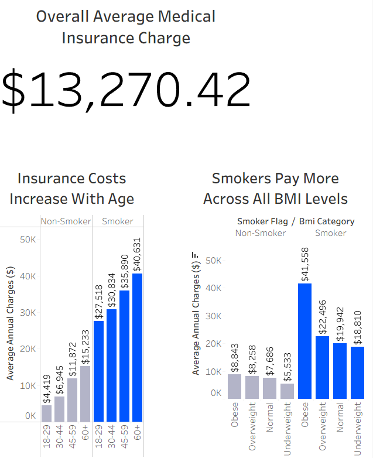

# 🏥 Healthcare Cost & Risk Analysis
**Tools:** Excel · SQL · Tableau
**Focus:** Cost Drivers & Risk Segmentation Analytics

---

## 📌 Project Overview

Healthcare costs have a direct impact on insurance pricing, risk exposure, and long-term profitability. Understanding which factors contribute most to higher medical charges allows insurers to design more accurate pricing models and proactive risk management strategies.

In this project, I analyzed individual-level medical insurance data to identify the primary drivers of healthcare costs and to highlight high-risk cost segments.

This project demonstrates a full end-to-end analytics workflow: data cleaning, segmentation analysis, business insight generation, and executive-ready visualization.

---

## 🎯 Objectives

- Identify the primary drivers of medical insurance charges
- Analyze how age, BMI category, smoking status, and region influence costs
- Segment individuals by cost exposure
- Communicate insights clearly using business-focused dashboards
- Provide actionable, data-backed recommendations

---

## 📊 Dataset Summary

**Dataset:** Medical Insurance Cost Dataset

**Key Features Analyzed:**
- Age
- BMI
- Smoking status
- Region
- Annual medical charges

**Derived Fields Created:**
- Age group segmentation
- BMI category segmentation
- Smoker flag indicator

---

## ❓ Key Business Questions

1. Which demographic and behavioral factors most strongly influence insurance charges?
2. How significant is the cost difference between smokers and non-smokers?
3. Do medical charges increase consistently across age groups?
4. How does BMI affect overall cost levels?
5. Are there meaningful regional differences in insurance charges?

---

## 🛠 Tools & Approach

### Excel
- Data cleaning and validation
- Creation of derived segmentation fields (age groups, BMI categories)
- Exploratory analysis using pivot tables

### SQL
- Aggregation of average charges by demographic segments
- Comparison of smoker vs. non-smoker cost impact
- Segmentation by age group, BMI category, and region
- Identification of highest-cost risk groups

### Tableau
- KPI display of overall average insurance charges
- Comparative visualization of cost drivers
- Business-focused dashboard design for executive interpretation

---

## 🔍 Key Insights

### 1️⃣ Smoking Is the Strongest Cost Driver

Smokers incur significantly higher average medical charges compared to non-smokers. Smoking status represents the most influential behavioral variable in predicting cost exposure.

---

### 2️⃣ Insurance Charges Increase With Age

Medical charges rise consistently across age groups, demonstrating a strong relationship between age and healthcare spending.

---

### 3️⃣ High BMI Amplifies Cost Risk

Higher BMI categories are associated with increased medical charges. The highest-cost segment consists of smokers within elevated BMI categories, indicating compounded risk factors.

---

### 4️⃣ Regional Variations Exist

Average charges vary across regions, suggesting geographic market differences that may influence cost structures and healthcare utilization patterns.

---

## 💡 Recommendations

1. **Incorporate smoking status heavily into pricing models**
Smoking represents the strongest predictor of elevated cost exposure and should be weighted accordingly in underwriting decisions.

2. **Develop targeted wellness initiatives**
Encourage preventative health programs and smoking cessation initiatives to reduce long-term claims risk.

3. **Refine age-based segmentation strategies**
Age segmentation can improve pricing precision and forecasting accuracy.

4. **Monitor high BMI risk segments**
Combined behavioral and health risk indicators should be prioritized within cost management strategies.

---

## ✅ Results Summary

This analysis identifies clear, actionable cost drivers based on demographic and behavioral segmentation. The findings provide a structured framework for improving pricing accuracy and strengthening risk management strategies.

---

## 📈 Business Value

Applying these insights can help organizations:
- Improve premium pricing accuracy
- Reduce long-term cost exposure
- Allocate underwriting resources more effectively
- Strengthen data-driven risk assessment processes

---

## 🧠 What This Project Demonstrates

- Strong understanding of cost-driver analytics
- Ability to segment and interpret healthcare cost data
- Proficiency in Excel, SQL, and Tableau
- Clear communication of insights for business decision-making

---

## 📎 Deliverables

- Cleaned and structured dataset
- SQL queries for cost segmentation analysis
- Executive-ready Tableau dashboard
- Business-focused recommendations

